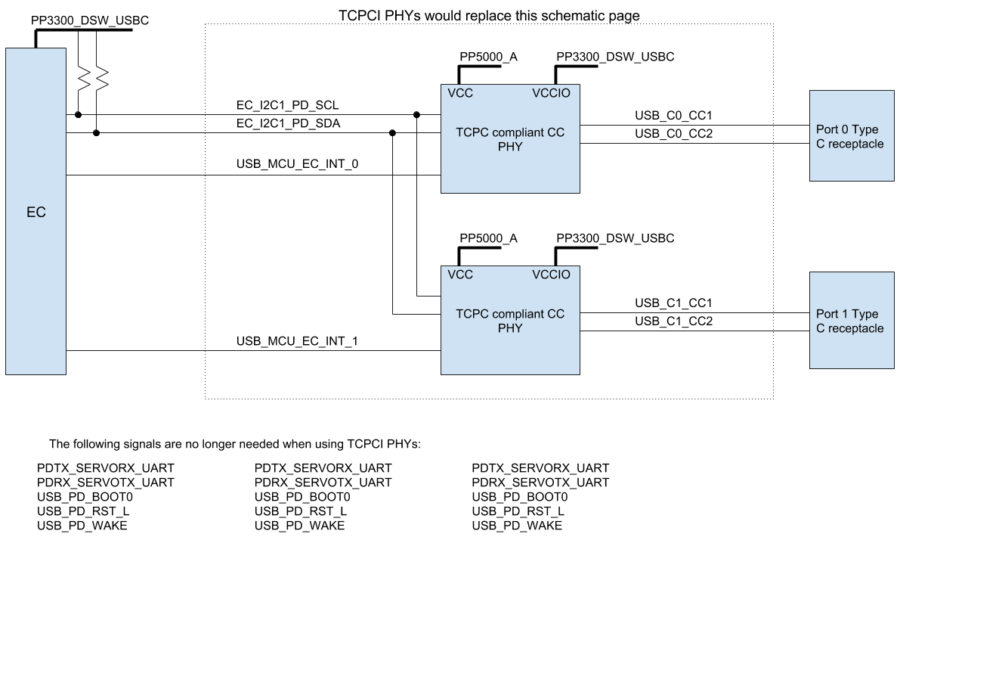

USB-C Dual TCPC Example
=======================

This board configuration implements a USB-C TCPC for two ports.

The design uses a microcontroller running code from the chromium EC
codebase to implement the TCPC.  The code tries to follow the
preliminary USB PD interface.

Building
--------

### ChromiumOS chroot

All the following instructions have been verified in a ChromiumOS chroot.
You can find how to set one up on the Chromium development wiki:
[http://dev.chromium.org/chromium-os/quick-start-guide](http://dev.chromium.org/chromium-os/quick-start-guide)

### Build the TCPM code

`cd src/platform/ec`

`make BOARD=glados_pd`

Schematic
---------

The [schmatic for the design](glados_pd.pdf) shows three main areas.

The two (identical) sections on the left provide the analog interface
to the CC line.  Each CC line is identical. Resistors are used in
combination to set the 1.5A Rp (`USB_Cx_CCy_DEVICE_ODL` high
impedance, `USB_Cx_CCy_HOST_HIGH` at 3.3V to give 5.11k+6.98k pullup)
or Rd (`USB_Cx_CCy_DEVICE_ODL` low, `USB_Cx_CCy_HOST_HIGH` high
impedance to give 5.11k pulldown). When USB-PD transmission is
required the `USB_Cx_CCy_MCU` is set low and the data transmitted on
`USB_Cx_CCy_TX_DATA` and the two resistor form a divider that sets the
level to match the BMC specification. These resistors may need tuning
for a given application to meet the required TX eye mask.

The isolation FET (two parts of `Q1`,two parts of `Q6`) serves to
disconnect the MCU when the 3.3V supply is off and protects the MCU
from CC going above 3.3V.

The Dead Battery Rd pulldown is provided by a FET (two parts of `Q24`
and `Q12` and resistor). When there is no power, the gate is pulled
down to ground. A DFP application of Rp will pull up the source and
provide the required Vgs=-0.7 to turn on the FET and connect the Rd
pulldown. When there is power and the microcontroller is running it
will drive `EN_PP3300_USB_PD` high and disable the FET.

There is a load switch (`U9`,`U10`,`U11`,`U12`) to provide current
limited **Vconn**.

The main area of the schematic is the STM32F051 microcontroller that
runs the `glados_pd` code.

There is a quirk in `U24`. For port `C0` the transmit data is provided
by the SPI1 controller as `SPI1_MISO`. The internal I/O multiplex
allows this to be driven on either pin `PB4` or `PA6` and thus support
driving whichever CC line is needed. Port `C1` uses the SPI2
controller which (on this package) can only use pin `PB14`, so an
external mux is used to direct this to the appropriate port.

### Replacement with Two TCPC parts

This schematic page can be replaced by two TCPC parts.

Flashing and Running
--------------------

### Flashing the firmware binary

The microcontroller can be pre-programmed or is programmed in the
factory by pulling `USB_PD_BOOT0` high and resetting the part to
intiate a firmware update over UART. During development the
[Servo board](http://www.chromium.org/chromium-os/servo) can be used
for this.

Once programmed for the first time, the part supports secure update of
the Read/Write copy.

Known Issues
------------

1. This doc is not finished yet ...

2. You might need a ChromeOS chroot ...

Troubleshooting
---------------

