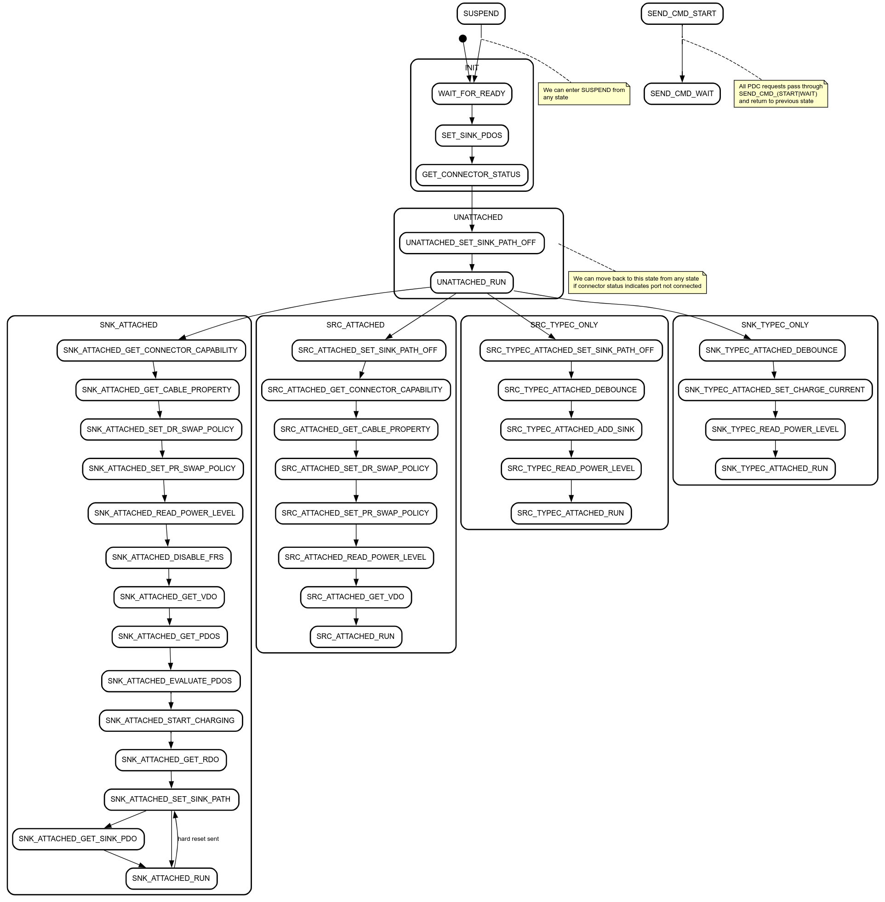

# Zephyr EC PDC Architecture

[TOC]

## Overview
TODO(b/384517822) - Document EC PDC Architecture

## PDC Console Commands
See `src/platform/ec/zephyr/subsys/pd_controller/pdc_console.c`

## PDC Driver API
See `src/platform/ec/zephyr/include/drivers/pdc.h`

### Supported drivers
See `src/platform/ec/zephyr/drivers/usbc/`

## Power Management
`src/platform/ec/zephyr/subsys/pd_controller/pdc_power_mgmt.c`

