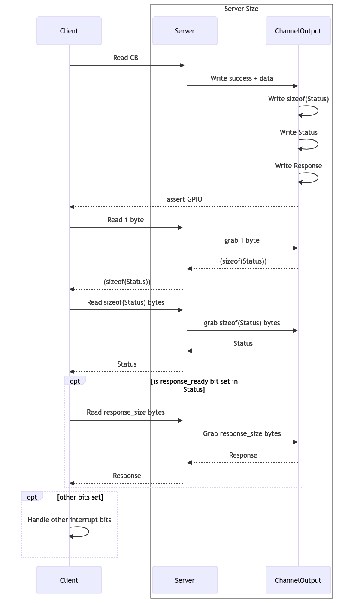

# DSP comms
The communication protocol designed to communicate with the DSP core on Chromium
boards. Currently, the comms channel supports the following messages:
* EC notifies the DSP of a lid-open event (GMR signal forwarding)
* EC notifies the DSP of a table-mode event (GMR signal forwarding)
* DSP request CBI values from EC

## Data flow
2 types of communications are supported:
1. Client driven
2. Server driven

In implementation the server driven communication is actually just a subset of
the client driven communication that stop before reading the response field and
initiates with the interrupt. The flow is:
1. Client sends a request over the bus.
2. Server handles the request and serializes the response. That response is then
placed on a buffer along with a header (_N_ bytes) and a header size (1 byte).
The server then fires an interrupt to notify the client that there's a header
ready to read.
3. Client reads 1 byte which tells it the size of the header. If the server's
lifecycle outlasts the client then the client may memoize the size for future
responses. This size is guaranteed never to change while the server is running.
4. Client reads _N_ bytes for the header. The header is endianess agnostic. It
contains 1 byte for the `response_length` and a _N-1_ long bitmask (`events`)
for event notification.
5. The client can broadcast events to any listeners and initiates a bus read for
`response_length` bytes.
6. The response is deserialized and used to satisfy the initial request.

Server driven communication begins with an event on the server which places a
header having `response_length = 0` and one or more bits set in `events`. The
server then fires the interrupt and the client reads the 1 byte + header. Since
the header has no response set, the transaction completes here.

</img>

## The server logic UML
</img>
